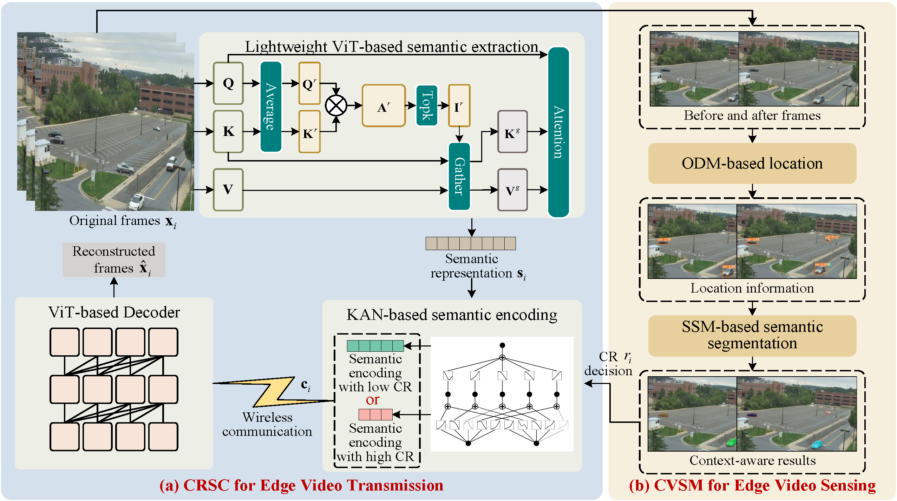

# Semantic Communications With Computer Vision Sensing for Edge Video Transmission
## Authors
### Yubo Peng; Luping Xiang; Kun Yang; Kezhi Wang; Mérouane Debbah
## Paper
### https://ieeexplore.ieee.org/document/11311355/

## Abstract
Despite the widespread adoption of vision sensors in edge applications, such as surveillance, video transmission consumes substantial spectrum resources. Semantic communication (SC) offers a solution by extracting and compressing information at the semantic level, but traditional SC without sensing capabilities faces inefficiencies due to the repeated transmission of static frames in edge videos. To address this challenge, we propose an SC with computer vision sensing (SCCVS) framework for edge video transmission. The framework first introduces a compression ratio (CR) adaptive SC (CRSC) model, capable of adjusting CR based on whether the frames are static or dynamic, effectively conserving spectrum resources. Simultaneously, we present a knowledge distillation (KD)-based approach to ensure the efficient learning of the CRSC model. Additionally, we implement a computer vision (CV)-based sensing model (CVSM) scheme, which intelligently perceives the scene changes by detecting the movement of the sensing targets. Therefore, CVSM can assess the significance of each frame through in-context analysis and provide CR prompts to the CRSC model based on real-time sensing results. Moreover, both CRSC and CVSM are designed as lightweight models, ensuring compatibility with resource-constrained sensors commonly used in practical edge applications. Experimental results show that SCCVS improves transmission accuracy by approximately 70% and reduces transmission latency by about 89% compared with baselines. We also deploy this framework on an NVIDIA Jetson Orin NX Super, achieving an inference speed of 14 ms per frame with TensorRT acceleration and demonstrating its real-time capability and effectiveness in efficient semantic video transmission.



## Model Definition
See [CRSC/models.py](CRSC/SC_models.py) for an overview of the CRSC framework.

See [CVSM/models.py](CVSM/CVSM.py) for an overview of the CVSM framework.

## Model Training
See [CRSC/train.py](CRSC/train.py) for more details of the training process.

## Citation   
```
@ARTICLE{11311355,
  author={Peng, Yubo and Xiang, Luping and Yang, Kun and Wang, Kezhi and Debbah, Mérouane},
  journal={IEEE Transactions on Mobile Computing}, 
  title={Semantic Communications With Computer Vision Sensing for Edge Video Transmission}, 
  year={2025},
  volume={},
  number={},
  pages={1-14},
  keywords={Videos;Sensors;Image coding;Encoding;Computational modeling;Adaptation models;Accuracy;Wireless sensor networks;Wireless communication;Computer vision;Semantic communication;computer vision;video transmission;intelligence sensing},
  doi={10.1109/TMC.2025.3646710}}
```

